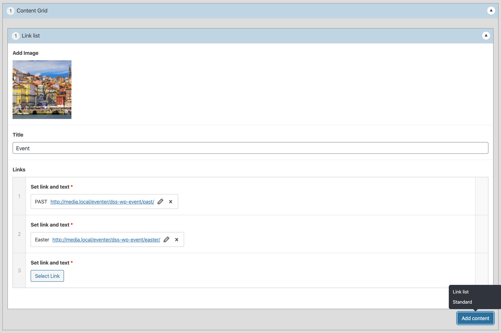

# Link list provider for [Hogan Content Grid](https://github.com/DekodeInteraktiv/hogan-content-grid)



## Hooks

- `hogan/module/content_grid/linklist/image_size/constraints`
- `hogan/module/image/image_size/preview_size`, default is `thumbnail`
- `hogan/module/image/image_size/library`, default is `all`
- `hogan/module/content_grid/linklist/image/args`, same as the args for `wp_get_attachment_image`, default is:
	```php
	[
		'size' => 'medium',
		'icon' => false,
		'attr' => [],
	]
	```
